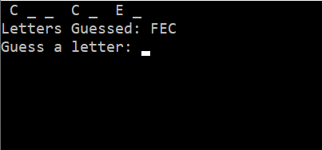

# Lab03-WordGuessGame
### Purpose
The purpose of this lab is to gain experience working with System.IO to read and write files to the hard disk and CRUD principles in the form of a word guessing game.

### User Story
Josie Cat has requested that a “Word Guess Game” be built. The main idea of the game is she must guess what a mystery word is by inputting (1) letter at a time. The game should save all of her guesses (both correct and incorrect) throughout each session of the game, along with the ability to show her how many letters out of the word she has guessed correctly.

Each time a new game session starts, the mystery word chosen should come from an external text file that randomly selects one of the words listed. This bank of words should be editable by Josie so that she may view, add, and delete words as she wishes. She expects the game to have a simple user interface that is easy to navigate.

### Screenshots

